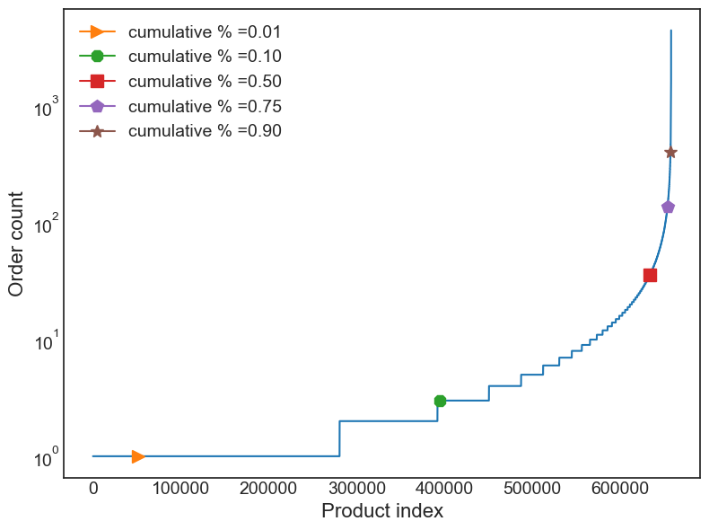

# otto-recommender
Recommender engine based on the otto dataset

## Notebooks

There are 3 notebooks of interest:

* [architecture.ipynb](./architecture.ipynb)
  * Architecture diagrams and short discussion points
* [prep-data.ipynb](./prep-data.ipynb)
  * Basically a script to read and normalize the `OTTO` dataset
* [train_model.ipynb](./train_model.ipynb)
  1. loads the normalized dataset
  2. explores and plots features from the dataset
  3. trains the `Word2Vec` model based on the filtered data
  4. compares the model against a random baseline algorithm with `recall@k` and `Mean Reciprocal Rank`

# Summary

The `Word2Vec` model scores around `4%` in the `recall@20` score. The random model almost always score a flat `0%`. We observe that the vocabulary (number of unique product IDs) is very large, wheighing in at `657940` which presents a challenging scenario compared to smaller vocabularies. Furthermore, the distribution is very tail-heavy:

That is, the vocabulary contains many rarely used words. It is not clear whether or not that presents a particular challenge to the `Word2Vec` approach compared to other approaches.